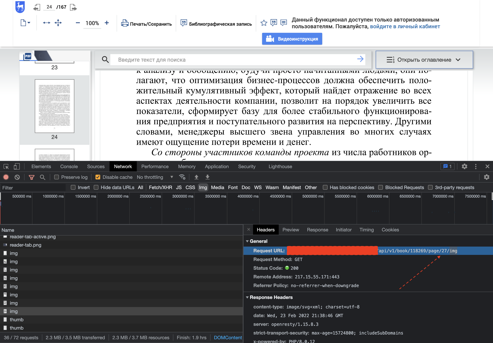

### Скачивание книг из библиотеки [ЭБС "Лань"](https://e.lanbook.com/)

> Данные материалы и программные средства предоставлены исключительно для ознакомления в образовательных целях. 
> Автор против любого неправомерного использования данных материалов и(или) призывов к таковому использованию третьими лицами.
> Автор не несет ответственности за любые действия третьих лиц и(или) за прямой или косвенный ущерб связанный с использованием или распространением данной информации.


Материалы предназначены для разработчиков ПО и специалистов по безопасности. Для воспроизведения действий описанных ниже требуются навыки использования `python`, `bash` и утилит Linux. 

### Суть метода

Метод заключается в поочередном скачивании страниц книг, их конвертации в формат PDF и последующей склейки страниц в один файл.
Нечто похожее можно реализовать с помощью браузерного JavaScript, но сейчас мы будем использовать `python` и `curl`

Читалка для книг в библиотеке "Лань" работает по простому принципу - она запрашивает изображения страниц с сервера обычным GET запросом. Страницы приходят в формате `SVG`, что идеально подходит для конвертации в `pdf` т.к мы не потеряем в качестве текста. 
Возможно эта читалка есть на гитхабе и ее используют другие ресурсы - простите, не проверял.

Чтобы воспроизвести действия описанные ниже, необходимы базовые навыки использования python и bash, а так же учетная запись на сайте  e.lanbook.com с возможностью чтения материалов.


### Установка зависимостей

В окружении должны быть установлены `python3`, `bash` и `curl`, а так же некоторые модули для `python`:

```bash
pip3 install PyPDF2 svglib
```

### Поиск ссылок для скачивания

В первую очередь нам необходимо найти адрес по которому находится изображение страницы, которое мы видим в читалке.

#### Oткрываем читалку и консоль браузера (F12):


#### Во вкладке "network" ищем запросы формата `/api/v1/book/{}/page/{}/img`:




#### Копирование команды cURL
Далее нам нужно скопировать команду для `curl`. Для этого нужно выбрать опцию `Copy as cURL` в контекстном меню:
Прелесть этой фичи заключается в том, что она копирует все необходимые заголовки, в том числе куки с нашей сессией. 
Поэтому перед запуском скрипта необходимо убедиться, что мы еще не превысили "лимиты чтения" и наша сессия активна.


#### Работа с cURL

Теперь нам нужно перенести запрос в bash скрипт `rip_page.sh` и заменить номера страниц на `$1`.

Пример содержания файла `rip_page.sh`:
```bash
curl "https://myaddress.xyz/api/v1/book/118269/page/$1/img" \
  -H 'authority: shit' \
  -H 'pragma: no-cache' \
  -H 'cache-control: no-cache' \
  -H 'sec-ch-ua: " Not A;Brand";v="99", "Chromium";v="98"' \
  -H 'sec-ch-ua-mobile: ?0' \
  -H 'accept: image/avif,image/webp,image/apng,image/svg+xml,image/*,*/*;q=0.8' \
  -H 'sec-fetch-site: same-origin' \
  -H 'sec-fetch-mode: no-cors' \
  -H 'sec-fetch-dest: image' \
  -H 'referer: https://myaddress.xyz/reader/book/118269' \
  -H 'accept-language: en-GB,en-US;q=0.9,en;q=0.8' \
  -H 'cookie: _ym_uid=; _ym_d=; LANEBSWS_orderMode=""; lan_access_token=lanananananoo.eyBanana.Base64; lan_refresh_token=; lan_unique_user=; _ga=; _ym_isad=2; sessid=; _ym_visorc=w; _gid=; _gat_UA-136619064-3=1' \
  --compressed > page-$1.svg
```

Обратите внимание, что в конец команды мы добавляем `> page-$1.svg`, а HTTP адрес  обернут в двойные кавычки `"`.

#### Запускаем скрипт `rip_book.py`

Скрипту необходимо передать количество страниц в книге:
```
python3 rip_book.py 234
```
Скрипт поочередно скачивает страницы, затем конвертирует их в `pdf` и в завершении склеивает все в один файл `the_book.pdf`.

#### Удаляем результат
Книги стоят дешевле чем подписка на Netflix, a использование результатов этой программы может быть незаконно. 
Поэтому, после того как мы проверим что книга получилась в достойном качестве необходимо удалить все файлы.

```
rm -rf .
```


